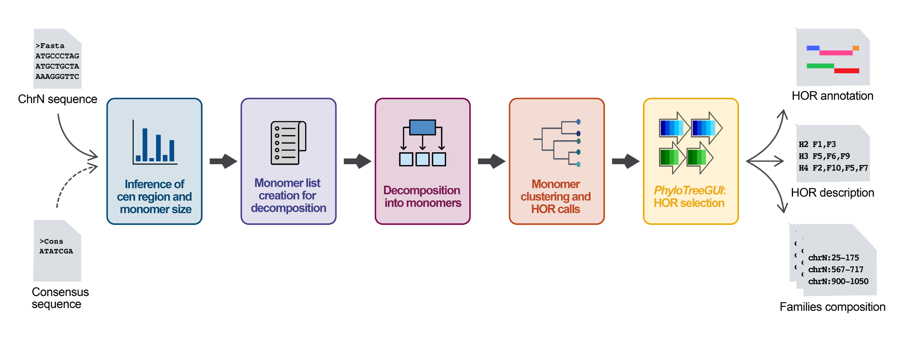

# CENdetectHOR pipeline

This Snakemake pipeline has been created to deeply analyze centromeric region, by taking as input single-chromosome (or centromere, if you already know its location) fasta sequences and optionally the consensus sequence of the centromeric satellite for the analysed organism. 
Without needing any other information, CENdetectHOR is able to:
- precisely locate the higly repetitive region of the input sequence;
- infer the size of the repetitive unit;
- extract all the monomeric sequences of the higly repetitive region;
- cluster monomers to phylogenetically identify Higher-Order Repeats (HORs) and monomer families.



CENdetectHOR has been implemented with [cen_detect_hor library](https://github.com/CENdetectHOR/CENdetectHOR_lib) for the HOR identification and with the [PhyloTreeGUI](https://github.com/CENdetectHOR/PhyloTreeGUI) to visualize the detected HOR, select the most informative ones, and export output files 

## Running CENdetectHOR pipeline

### Setting up the environment

To run CENdetectHOR, we raccomend creating a new `conda env` with a current version of `snakemake` to run this workflow. To get `snakemake` please check the [install instructions on their website](https://snakemake.readthedocs.io/en/stable/getting_started/installation.html). 

Alternatively, you can clone the repo with:
```
git clone https://github.com/CENdetectHOR/CENdetectHOR_pipeline.git
```

Then, you can create the `conda env` env and activate it with: 
```
conda env create -f CENdetectHOR.yml
conda activate cendetecthor
```

### Running

To run CENdetectHOR, create a `fasta` directory in your workdir and place all the fasta files in the format `SampleID.chrN.fasta` to be analyzed there. Then, specify the path of the workdir in the [config.yaml](config/config.yaml) file accordingly.

Once this is done and you have activated your `conda env` you can run the pipeline like so:
```
snakemake --cores 24
```
Or do a dry run of the pipeline:
```
snakemake --cores 24 -n
```
All parameters are described [here](config/README.md) and you can modify any of them by directly editing the [config.yaml](config/config.yaml) file or via the command line. For example, to change the fasta location do:
```
snakemake --cores 24 --config workdir=/some/workdir/path/
```

### Running by submitting jobs to a HTCondor cluster. 

The pipeline has been developed and tested by submitting jobs to a HTCondor cluster using [HTCondor Snakemake profile](https://github.com/Snakemake-Profiles/htcondor). 
The required libraries are already present in the `CENdetectHOR.yml`, but you will need to deploy the profile as specified in the [repo](https://github.com/Snakemake-Profiles/htcondor). 
Then, you can run the pipleine by using:
```
snakemake --profile htcondor
```


